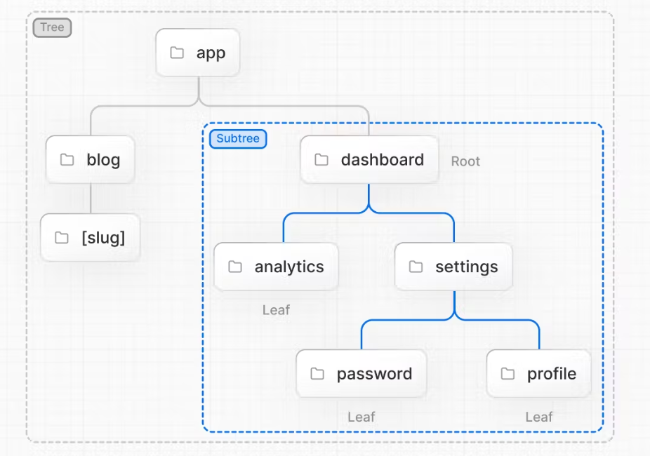

Next js
 CLI create project template
 npx create-next@latest

# Router Fundamantal

## Tree
  
## Subtree
## Root
## Leaf
## URL Segment:
  * Part of the URL path delimited by slashes.
 
## Roles of Folders and Files

## Route Segments

## Nested Routes

### layout
 2
 3
 
 3
 4
 
 5
 6
 7
 